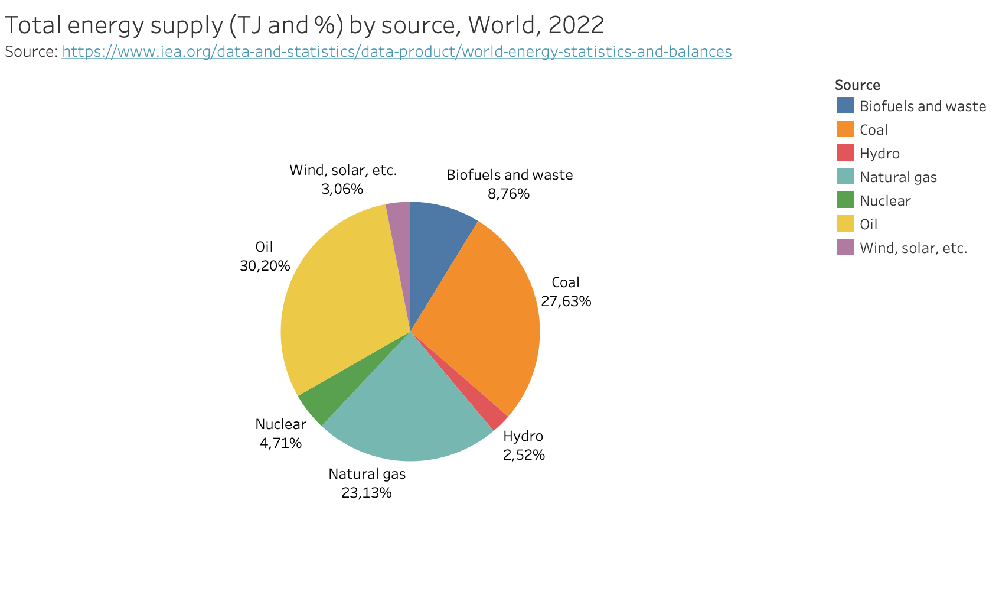
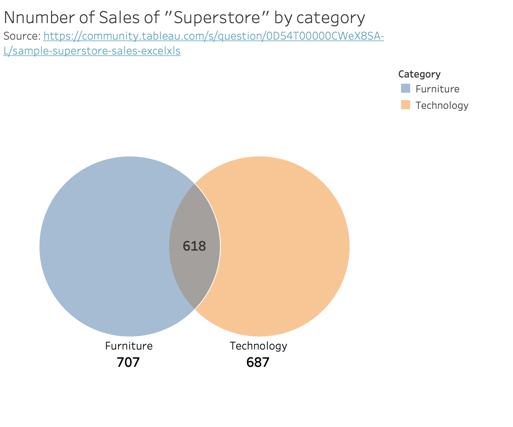
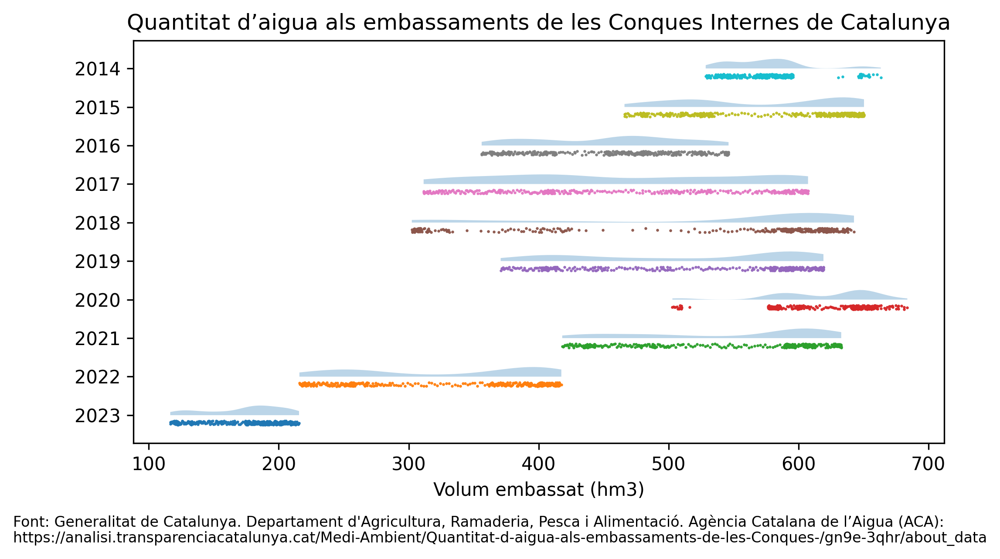

# PAC2

## Data visualization techniques

The data visualization techniques I've been assigned in this project are:

### Pie chart

For this simple visualization I will show the distribution of world's energy supply divied by source. The data is represented in the following pie chart, also accessible as a [interactive visualization](https://public.tableau.com/app/profile/francesc.raga/viz/PieChart_17304977333880/PieChart) in Tableau Public.

This data was obtained from [World Energy Balances](https://www.iea.org/data-and-statistics/data-product/world-energy-statistics-and-balances).

### Venn Diagram

This simple diagram shows the number of sales of "Superstore" by Product's category. The data is represented in the following Venn Diagram, displaying the number of sales of each category and the intersections between them. This data is represented in the following plot and it's also accessible as a [interactive visualization](https://public.tableau.com/app/profile/francesc.raga/viz/VennDiagram_17304979368280/VennDiagram) in Tableau Public.

The sample data was appeared in December's Tableau User Group presentation, and was obtained by Michael Martin for the Tableau community. The data can be found [here](https://community.tableau.com/s/question/0D54T00000CWeX8SAL/sample-superstore-sales-excelxls).

### Rain cloud Plot

For this visualization I've chosen to represent the percentage of the total volume of water stored in the reservoirs of the Internal Basins of Catalonia. This data is represented in the following plot:

The data was obtained from the Generalitat de Catalunya. Departament d'Agricultura, Ramaderia, Pesca i Alimentació. Agència Catalana de l’Aigua (ACA) and can be found [here](https://analisi.transparenciacatalunya.cat/Medi-Ambient/Quantitat-d-aigua-als-embassaments-de-les-Conques-/gn9e-3qhr/about_data).