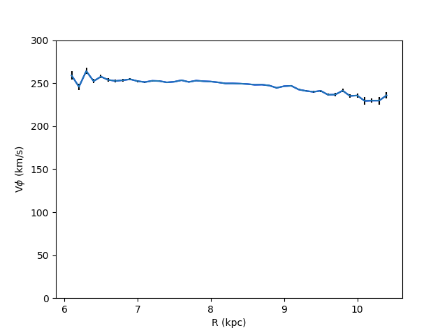

# Projecte
## Study on the Presence of Dark Matter in the Milky Way

### Introduction
The presence of dark matter in the Milky Way has been a subject of extensive study and debate. Dark matter is a form of matter that does not emit, absorb, or reflect light, making it invisible and detectable only through its gravitational effects. This study aims to explore the evidence for dark matter in our galaxy by analyzing the rotation curves and mass distribution.

### Rotation Curve Analysis
One of the key pieces of evidence for dark matter comes from the rotation curves of galaxies. A rotation curve plots the orbital velocity of stars and gas in a galaxy against their distance from the galactic center. According to Newtonian mechanics, we would expect the velocity to decrease with distance from the center. However, observations show that the velocity remains constant or even increases at larger distances.

*Figure 1: Rotation curve of the Milky Way showing that the velocity does not decrease with distance.*

### Interactive Mass Distribution Model
To further investigate the presence of dark matter, we provide an interactive model that allows users to propose their own mass distribution. This model includes three components: a bulge, a disk, and a halo. Users can adjust the mass and shape of these components to fit the theoretical potentials with the observed rotation curve.

[Interactive Mass Distribution Model](figures/interactive_plot.html)
*Figure 2: Interactive figure allowing users to propose mass distribution to fit the theoretical potentials with the observed rotation curve.*

### Conclusion
The constant velocity observed in the rotation curves strongly suggests the presence of an unseen mass, which we attribute to dark matter. By using interactive models, we can better understand the distribution and impact of dark matter in the Milky Way.

### References
- [1] Rubin, V. C., Ford, W. K. (1970). Rotation of the Andromeda Nebula from a Spectroscopic Survey of Emission Regions. The Astrophysical Journal, 159, 379.
- [2] Sofue, Y., Rubin, V. (2001). Rotation Curves of Spiral Galaxies. Annual Review of Astronomy and Astrophysics, 39, 137-174.
