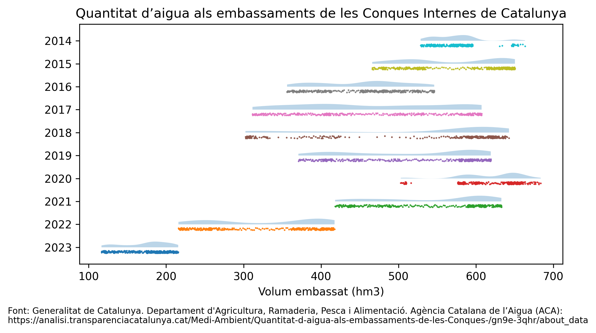

## About

This is a simple GitHub Page created to publish the result of the representations for the PAC2 exercice. This is it's only purpose, therefore this page will be acordingly replaced or refactored once the evaluation of this activity is published.

## Data visualization techniques

The data visualization techniques I've been assigned in this project are:

### Pie chart

### Venn Diagram

### Rain cloud Plot

For this visualization I've chosen to represent the percentage of the total volume of water stored in the reservoirs of the Internal Basins of Catalonia. This data is represented in the following plot:

The data was obtained from the Generalitat de Catalunya. Departament d'Agricultura, Ramaderia, Pesca i Alimentació. Agència Catalana de l’Aigua (ACA) and can be found [here](https://analisi.transparenciacatalunya.cat/Medi-Ambient/Quantitat-d-aigua-als-embassaments-de-les-Conques-/gn9e-3qhr/about_data).

## Contact

If you have any questions, feel free to contact me. If you were expected to visit this page you should already know how to reach me.